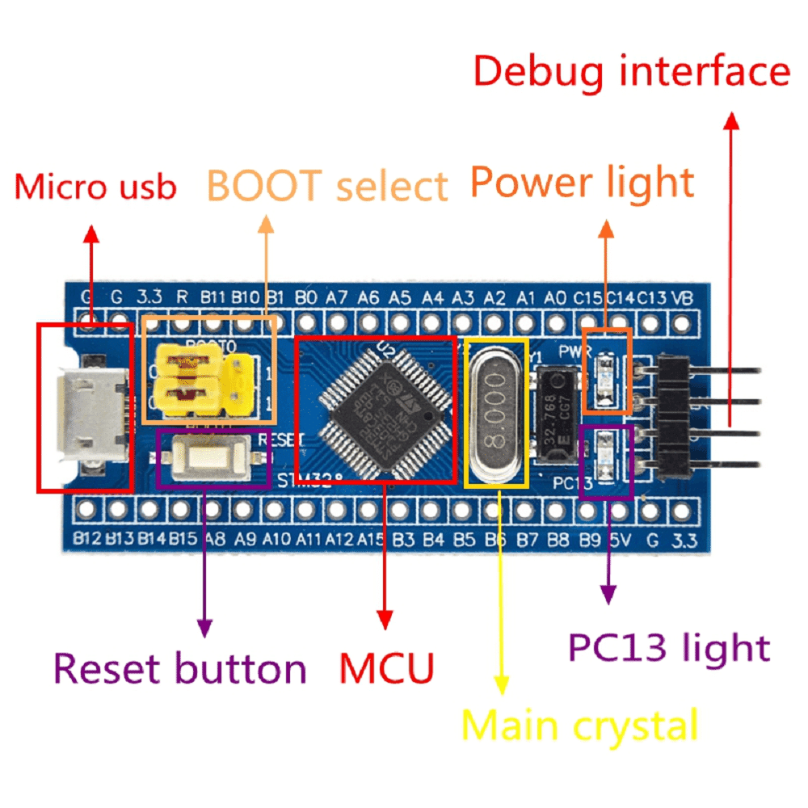

# Intro
The Goal of this project was to implement secure boot, and secure firmware flash for programmable stm32 microschip.

# Hardware

### Overview
STM32F103C8T6 microcontroller.


### Caracteristiques

    CPU: 32-bit ARM CORTEX-M3 72 MHz
    Flash Mem space: 64KiB
    SRAM: 20KiB

# Implementation
The flash memory was split into to sections 1st section for our stage 2 bootloader, and the 2nd for the firmare application.

### Bootloader
    Base address: 0x8000000
    Size: 16KiB

The last 74 bytes of the bootloader section contains informations about the installed firmware and is update every time we update the firmware.
all the bootloader code is contained in `boot` folder.

the following informations is contained in the firmware info section

### Firmware info section
- Firmware version: 4 bytes.
- Firmware size: 4 bytes.
- Firmware signature: 64 bytes.

the firmware version is used to defend against replay attack where attacker might send old firmware versions that might contain some vulnerability.

the firmware signature is used to verify the firmware code at boot, the signing algorithme used is **ECDSA** an asymetric algorithme that allows us to keep our *signing key* safe and only load the *verifying key* inside the micro-controller, this way we don't have to worry about an attacker 
reading the flash memory and finding out our *signing key*.

The `scripts` folder holds python scripts for generating keys and signing firmware
the latter is done automatically when using **make** to build update.

### Firmware Update
in order to test our implementation we need mecanisme for updating the firmware.

there exist various ways to do that such **OTA**,**CAN**...etc.
in our case we rolled out a quick firmware update tool over **UART**.

the code for this tool is in `firmware-updater` folder it written in **Rust language** and supports windows and linux OS.
the firmware updater uses the following configuration for UART

### UART Config
    Baud rate: 115200
    Packet size 8 bits
    1 start bit, 1 stop bit and 0 parity bit
    10 bits to send an 8 bits data
    debit : 115200/10 = 11,520 KiB.

the firmware-updater communicate with the micro-controller using the following simple packet protocol:

### Packet Protocol
    24 bytes packet:
        1 byte: packet size.(0~255);
        19 bytes: packet payload.
        4 byte: CRC32 checksum.

    Control datagramme
    ACK: length=1 , 1st Byte = 0x06
    Retransmit: length=1 , 1st Byte = 0x07

### Bootloader state machine
The bootloader uses a state machine that works in the following way:

1. After Reset wait for an update request timeout is 5s.

2. If there is no update request we verify the firmware signature and proceed accordinly

3. If the firmware is verified we switch to it else we loop forever until reset.

4. If there was an update request we proceed with to receiving the new firmware data we then read then verify it's signature.

5. If the update was verified we write it to the flash memory and switch to it

6. If it isn't verifed we discard the firmware data and proceed with step 2


# Commands
The following command can be used to build the bootloader:

```bash
make bootloader
```
The following command can be used to build a signed firmware image:

```bash
make update <version-number>
```

the version number should start with 1 and be incremented for every new version you want to install.


# Notice
The various libraries used in this project were not checked for secuirty issues.
and should be vetted before using this in production.