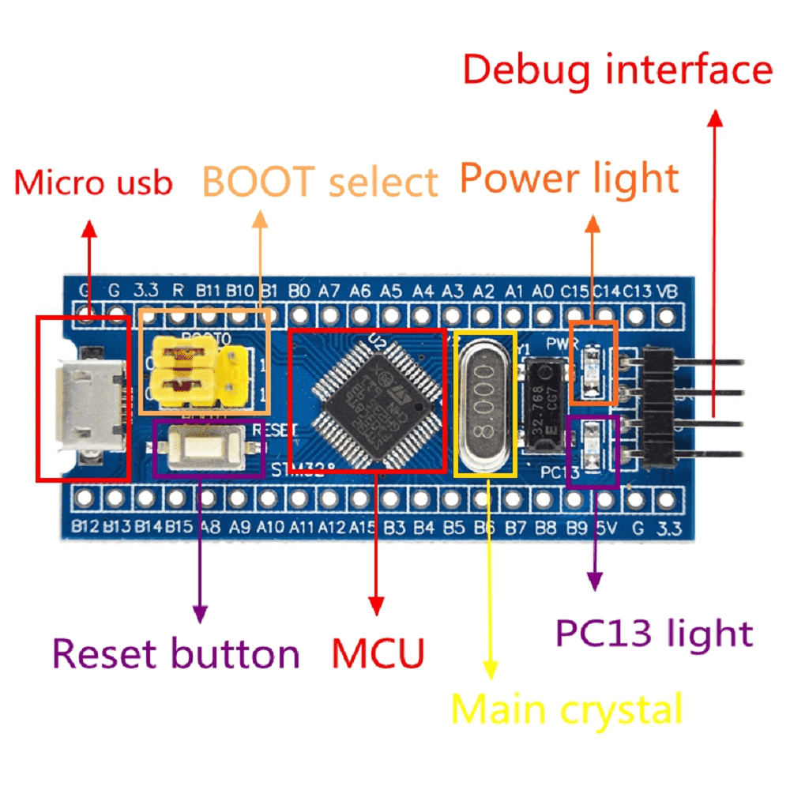
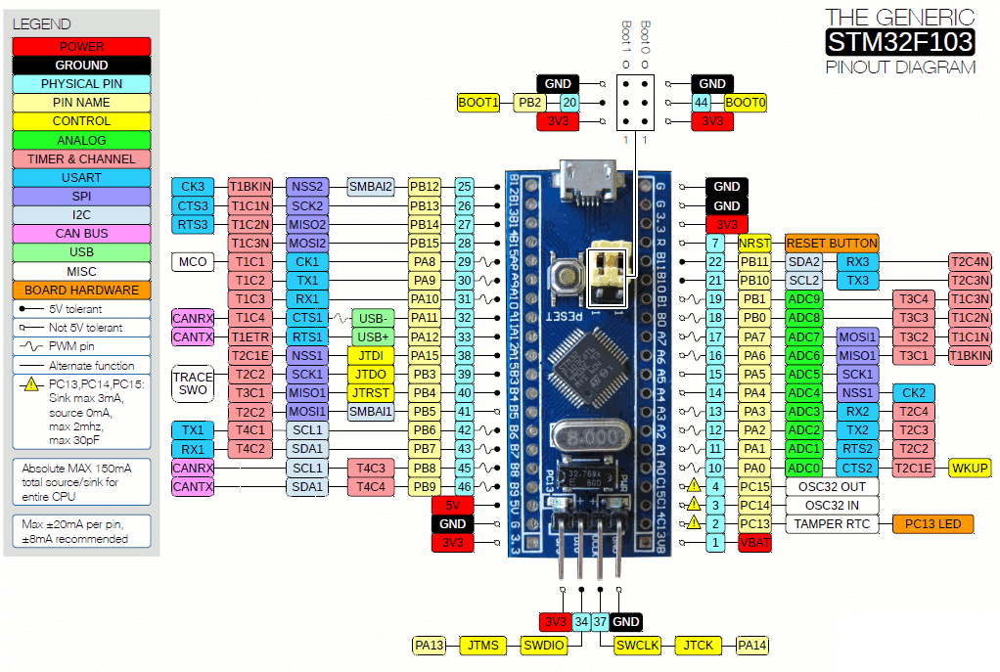
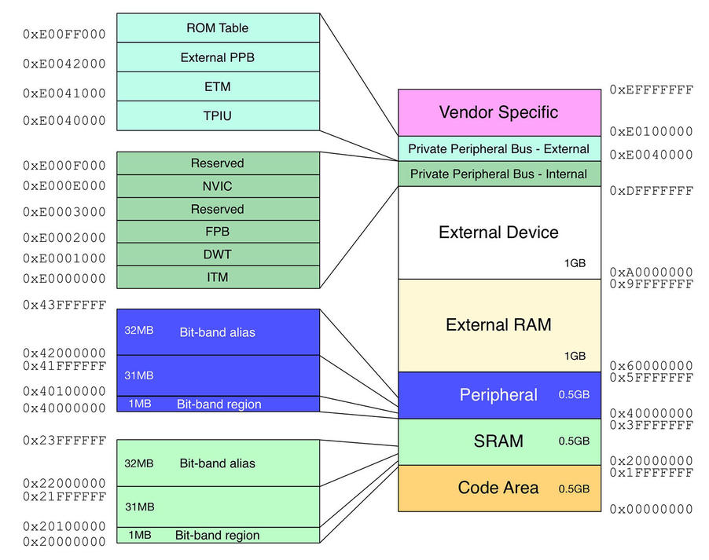

# Intro

The Goal of this project is to implement secure boot, and secure firmware flash for programmable microschip.

# Hardware

STM32F103C8T6 microcontroller.

## Caracteristiques

    CPU: 32-bit ARM CORTEX-M3, frequence 72 MHz
    Flash Mem: 64KB
    SRAM: 20KB

## MCU Overview

## Memory Map

## Bootloader
    Size 16KiB
    Base adress 0x8000000

## UART
    Packet size 8 bits
    Baud rate 115200
